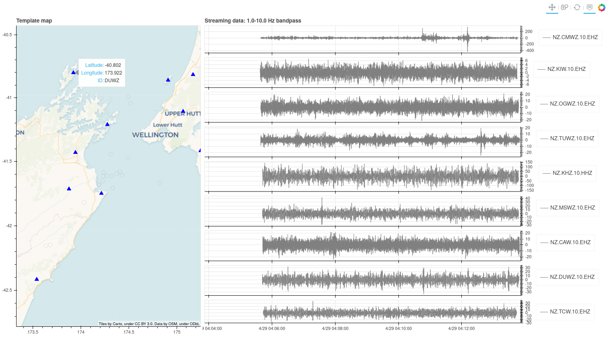

Quickstart
==========

RT-EQcorrscan ships with a few scripts.  Now that you have the package installed, you
probably want to dive right in and see what this puppy can do?

Setup
-----

Let's get started by making a directory to work in (all the following will be bash commands):

.. code-block:: bash

    mkdir my_first_detector
    cd my_first_detector

Then we need to configure our system.  To generate a default configuration file (you can
edit this later) you can run (note that all of these scripts have documentation available using
the :code:`--help` flag):

.. code-block:: bash

    rteqcorrscan-config

This will make a YAML file, you can open that and have a look at the configuration in there.
Later tutotials will explain some/all of these values in more detail.

Build a database
----------------

Now you need a template database. For this *quickstart* we will make a small database, but
you will probably want to make something bigger for your real work.

To make the database run the following:

.. code-block:: bash

    rteqcorrscan-build-db --config rt-eqcorrscan-config.yml -s 2020-01-01 -e 2020-01-10

This will take a while to run!  **Grab a beverage of your choice...**

This script will build a database of templates using the values in your
configuration file (with the filename specified by the :code:`--config` flag) between a start-date and
an end-date (specified by the :code:`-s` and :code:`-e` options respectively).

Going real-time
---------------

Once that has finished you are ready to go! You have a few options here, either simulating an old
sequence (using the :code:`rteqcorrscan-simulation` script), running a reactor process to react to large events
or high-rate sequences (:code:`rteqcorrscan-reactor`), or just run a real-time matched-filter process
with your templates.

In this quickstart we will just showcase the real-time matched-filter process because this
will (almost) immediately bring us a plot to look at.  To see more about all these scripts
and those not covered here, checkout the :doc:`tutorials`.

To run a real-time matched-filter, use the :code:`rteqcorrscan-real-time-match` script:

.. code-block:: bash

    rteqcorrscan-real-time-match --config rt-eqcorrscan-config.yml --latitude -41.7 --longitude 174 --radius 1.0

This will query your template database for templates within the region specified by the :code:`--latitude`,
:code:`--longitude` and :code:`--radius` arguments, then start streaming data appropriate for those templates.
It will then periodically scan those templates through the streaming data and make detections.

If you have left the default configuration values you should see a plot pop-up in a browser window
that looks something like this (I left mine running for 8 minutes for the plot buffer to start to fill-up),
with data streaming in:

These plots are made up of an interactive map showing stations in use (triangles) and template locations
(open circles), and streaming waveform data on the right.  Data are filtered according to parameters in
your config file, and the bandpass is printed at the top of the plots.

When a detection is made, dashed red lines appear on the waveforms at the pick-times for that detection
and the location circle on the map for the template used for detection turns
red.  Over time the template colour fades.